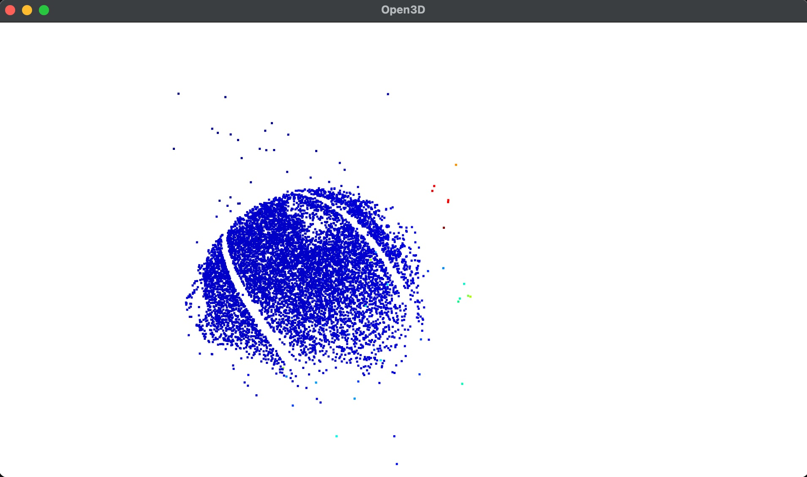

# 3D Structure from Motion (SfM)

A Python pipeline for 3D reconstruction from 2D images using classical computer vision techniques. The pipeline supports **incremental multi-view reconstruction**: it selects the best initial camera pair, then registers new views one by one and triangulates new 3D points across all views.

---

## Pipeline Overview

```
Images → Camera Calibration → Undistortion → SIFT Feature Extraction
       → Best Initial Pair Selection (Essential Matrix + RANSAC)
       → Pose Recovery (R, t) → Initial Triangulation
       → Incremental View Registration (PnP + RANSAC)
       → New Point Triangulation + Depth Filtering
       → 3D Point Cloud (.ply)
```

---

## Features

- **Camera calibration** using a chessboard pattern (OpenCV)
- **Distortion correction** with optional optimal camera matrix
- **SIFT keypoint detection** for robust feature extraction across views
- **Feature matching** using Brute-Force matcher with Lowe's ratio test
- **Best initial pair selection** — the pair maximizing Essential Matrix inliers initializes the reconstruction
- **Essential matrix** estimation with RANSAC (prob=0.999, threshold=1.0 px)
- **Camera pose recovery** (R, t) from matched points
- **Incremental multi-view registration** — new views are added via PnP (Perspective-n-Point) with RANSAC, using 2D-3D correspondences with already registered views (minimum 20 matches, 30 inliers required)
- **3D triangulation** with depth filtering — only points visible in front of both cameras are kept
- **Point cloud visualization** and export (`.ply`) with Open3D
- **Bundle adjustment** (scaffolded, optional — `scipy.optimize.least_squares`)

---

## Project Structure

```
.
├── main.py                   # Entry point
├── multi_view_pipeline.py    # Core SfM pipeline (View class, sfm(), bundle_adjustment())
├── cam_calibration.py        # Camera calibration (chessboard)
├── features.py               # SIFT detection
├── matching.py               # Feature matching
├── triangulation.py          # 3D triangulation
├── pose.py                   # Pose estimation
├── pointcloud.py             # Point cloud generation and export
├── mesh.py                   # Mesh utilities
├── help.py                   # Utility functions
├── environment.yml           # Conda environment
└── README.md
```

---

## Installation

```bash
conda env create -f environment.yml
conda activate 3d_geometry
```

---

## Usage

### Calibrate camera only
```bash
python main.py -c
```

### Calibrate + apply optimal undistortion matrix
```bash
python main.py -c -o
```

### Run without calibration (uses approximate focal length)
```bash
python main.py
```

---

## Configuration

### Multi-view reconstruction (`main.py`)

Update the `images` list with your input photos. The pipeline accepts **any number of views** — the more views, the denser the point cloud. Images should be taken by walking around the object with overlapping coverage.

```python
images = [
    "for_reconstruction3/IMG_4175.JPG",
    "for_reconstruction3/IMG_4176.JPG",
    # ... add as many views as needed
    "for_reconstruction3/IMG_4199.JPG"
]

ret, K, dist = calib(folder_path="Calibration2")  # Camera calibration
all_pcd = multi_view(images, K)                    # Multi-view reconstruction
mesh = poisson_mesh(all_pcd)                       # Poisson surface mesh
```

The pipeline automatically:
1. Extracts SIFT features from all views
2. Selects the best initial pair (maximum Essential Matrix inliers, min. 50 matches)
3. Triangulates the initial 3D point cloud
4. Exports the result to `point_cloud/output_ball.ply`

### Chessboard calibration settings (`cam_calibration.py`)
| Parameter | Default | Description |
|-----------|---------|-------------|
| `Ch_Dim`  | (8, 6)  | Inner corners (cols, rows) |
| `Sq_size` | 24 mm   | Physical square size |

---

## Output

| File | Description |
|------|-------------|
| `calibrated_data.npz` | Camera matrix, distortion coefficients, R/T vectors |
| `undistort_img1.jpg`  | Undistorted image |
| `Original_grid.jpg`   | Original image with grid overlay |
| `Undistorted_grid.jpg`| Undistorted image with grid overlay |
| `output.ply`          | 3D point cloud (Open3D / MeshLab compatible) |

**Example result — basketball reconstructed from 25 views:**



> The blue cluster represents the reconstructed ball surface. Scattered colored points are outliers that can be removed with statistical filtering in Open3D.

---

## Dependencies

Key libraries (see `environment.yml` for full list):

- [OpenCV](https://opencv.org/) — image processing, calibration, feature detection
- [Open3D](http://www.open3d.org/) — 3D point cloud processing and visualization
- [NumPy](https://numpy.org/) — matrix operations

---

## References

- [SfM tutorial — CMSC426](https://cmsc426.github.io/sfm/)
- [Camera calibration — OpenCV docs](https://docs.opencv.org/4.x/dc/dbb/tutorial_py_calibration.html)
- [SIFT descriptor — GeeksforGeeks](https://www.geeksforgeeks.org/sift-interest-point-detector-using-python-opencv/)
- [ORB feature descriptor](https://github.com/ImranNawar/orb_feature_descriptor)
- [3D SfM — ekrrems](https://github.com/ekrrems/3D-Structure-from-Motion)
